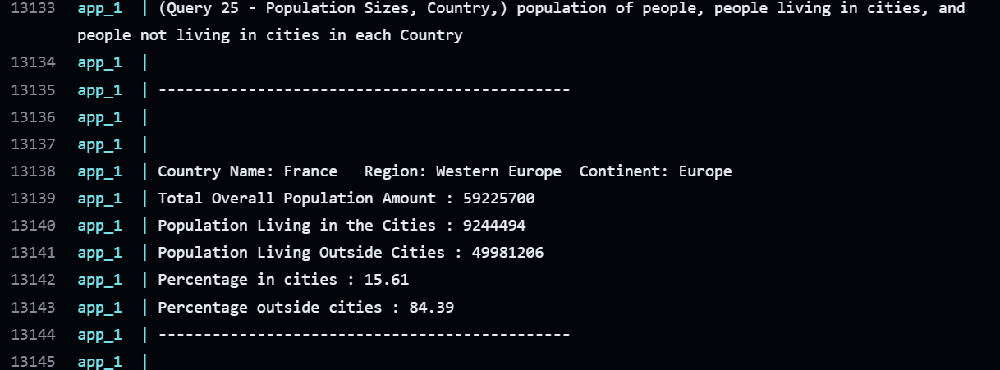
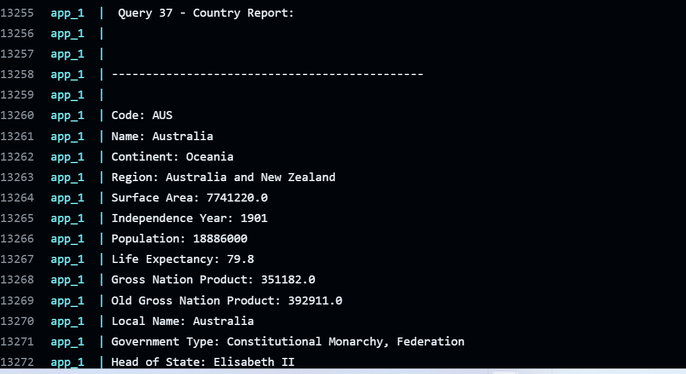

# seMethod
## Group 16

### Important! - Screenshots for Evidence at the bottom of this readme

---

##### This is a group project using a Java Development environment to query a database

###### [*Emmanuel Ikechukwu Benson*](https://github.com/Emmaben)
###### [*Ananya Akula Akula*](https://github.com/Okehusingit)
###### [*Diya Sharma*](https://github.com/Diya2715)
###### [*Neil Mckenna*](https://github.com/neil-mckenna)

---

* Master Build Status 
* Develop Branch Status 
* Release Branch Status 
* Mysql/feature Branch Status 

* License 

* Release 

* Code Cov 

---
## Some helpful commands when debugging or configuring docker files

---
#### if you can't get local server to communicate with app , use this command in the terminal
#### mongo here is the name of docker container
docker run -p 27017:27017 -d mongo

---
#### when docker compose is not updating to the changes due to the cache, overwrite with this 
docker-compose up --build

docker-compose build --no-cache

---
## Below is the screenshots for the Query Evidence

### We believe that we completed 32 out of 32 requirements.
#### Please Check Below for verification

---

##### Query - 1 => All the countries in the world organized by largest population to smallest

##### Query - 2 => All the countries in a continent organized by largest population to smallest.

##### Query - 3 => All the countries in a region organized by largest population to smallest.

##### Query - 4 => The top N populated countries in the world where N is provided by the user.

##### Query - 5 => The top N populated countries in a continent where N is provided by the
##### user.

##### Query - 6 => The top N populated countries in a region where N is provided by the user.

##### Query - 7 => All the cities in the world organised by largest population to smallest.

##### Query - 8 => All the cities in a continent organised by largest population to smallest.

##### Query - 9 => All the cities in a region organized by largest population to smallest.

##### Query - 10 => All the cities in a country organized by largest population to smallest.

##### Query - 11 => All the cities in a district organized by largest population to smallest.

##### Query - 12 => The top N populated cities in the world where N is provided by the user.

##### Query - 13 => The top N populated cities in a continent where N is provided by the user.

##### Query - 14 => The top N populated cities in a region where N is provided by the user.

##### Query - 15 => The top N populated cities in a country where N is provided by the user.

##### Query - 16 => The top N populated cities in a district where N is provided by the user.

##### Query - 17 => All the capital cities in the world organized by largest population to
##### smallest.

##### Query - 18 => All the capital cities in a continent organized by largest population to smallest.

##### Query - 19 => All the capital cities in a region organized by largest to smallest.

##### Query - 20 => The top N populated capital cities in the world where N is provided by the
##### user.

##### Query - 21 => The top N populated capital cities in a continent where N is provided by the
##### user.

##### Query - 22 => The top N populated capital cities in a region where N is provided by the
##### user.

##### Query - 23 => The population of people, people living in cities, and people not living in
##### cities in each continent.

##### Query - 24 => The population of people, people living in cities, and people not living in
##### cities in each region.

##### Query - 25 => The population of people, people living in cities, and people not living in
##### cities in each country.

##### Query - 26 => The total population of the world.

##### Query - 27 => The population of a continent

##### Query - 28 => The population of a region.

##### Query - 29 => The population of a country.

##### Query - 30 => The population of a district

##### Query - 31 => The population of a city.

##### Query - 32 => The percentage of the world population who speak ***Chinese***.

##### Query - 33 => The percentage of the world population who speak ***English***.

##### Query - 34 => The percentage of the world population who speak ***Hindi***.

##### Query - 35 => The percentage of the world population who speak ***Spanish.***

##### Query - 36 => The percentage of the world population who speak ***Arabic.***

##### Query - 37 => A country report

##### Query - 38 => A city report

##### Query - 39 => A capital report

---

End of Queries